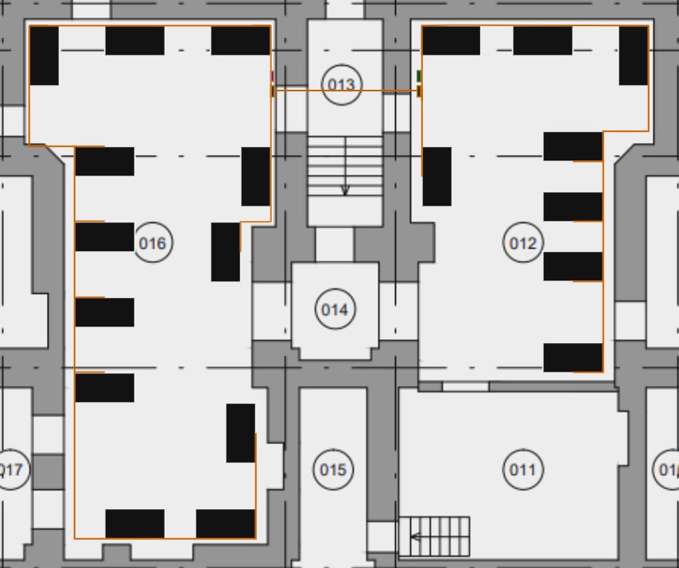
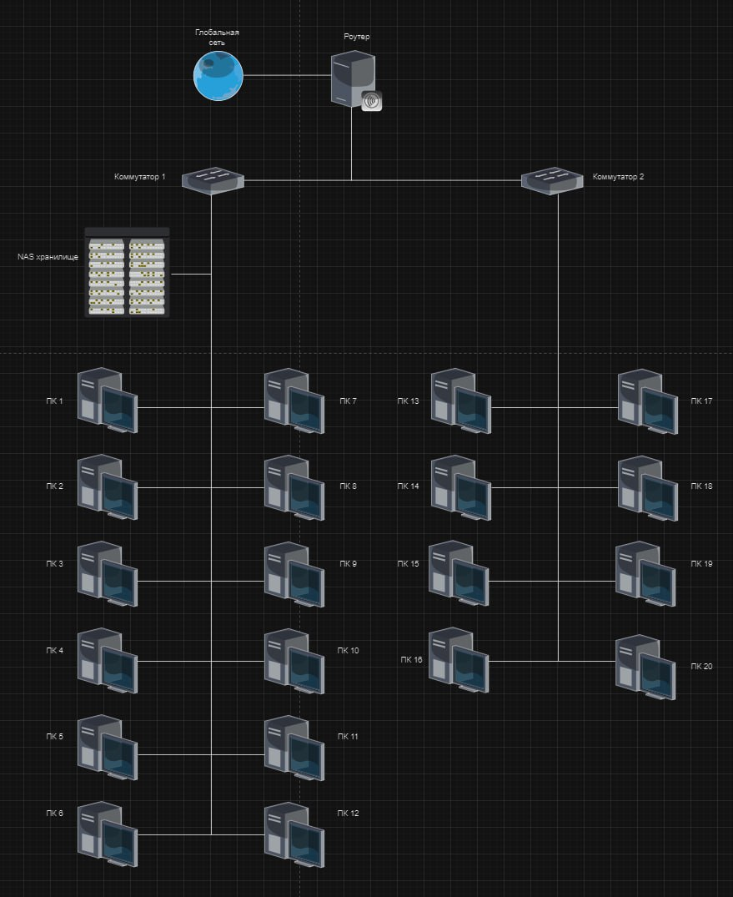

# Отчет по лабораторной работе №1. Бригада №1

В рамках данного проекта было проведено исследование потребностей офиса в современном компьютерном оборудовании. Нашей задачей было подобрать наиболее оптимальный набор оборудования с учетом бюджетных ограничений и технических требований.

## Содержание

1. [Введение](#Отчет-по-закупке-оборудования-для-офиса)
2. [Список исполнителей](#Список-исполнителей)
3. [Офисные компьютеры](#Офисные-компьютеры)
4. [Графические рабочие станции](#Графические-рабочие-станции)
5. [Сетевое оборудование](#Сетевое-оборудование)
6. [Вывод](#Вывод)

---

## Список исполнителей

**Московский Авиационный Институт (МАИ)**  
*Институт 3 «Системы управления, информатика и электроэнергетика»*  
Кафедра 307 «Цифровые технологии и информационные системы»

**Студенты группы М3О-214Б-22:**

- Бедретдинов Андрей Маратович
- Горбачёв Артём Евгеньевич
- Крылова Екатерина Константиновна
- Наумов Никита Александрович
- Петров Андрей Валерьевич
- Мельников Артём Александрович

---

## Офисные компьютеры и периферия

| Наименование | Количество | Итоговая сумма, руб. |
|--------------|------------|----------------------|
| Machcreator MK21FLT1RU (монитор) | 20 | 133400 |
| Defender Optimum MB-160 (мышь) | 20 | 3800 |
| Defender HM-830 (клавиатура) | 20 | 11760 |
| ATX Accord JP-IV (корпус для пк) | 20 | 54800 |
| AMD R748G2400U2S-U DIMM 8Gb DDR4 | 14 | 23562 |
| Intel Core i3 9100 OEM | 14 | 184940 |
| ASRock H310CM-DVS (материнская плата) | 14 | 76398 |
| DEEPCOOL CK-11508 PWM LGA115X (кулер) | 14 | 6244 |
| EX221635RUS (БП 300 Вт) | 14 | 22400 |
| Seagate Barracuda ST2000DM008 (жёсткий) | 20 | 135580 |
| Gembird FANCASE3 (вентилятор для корпуса) | 80 | 30000 |
| **Итого** | | **589444 руб.** |

Для офисных компьютеров был подобран оптимальный набор оборудования. Материнская плата ASRock H310CM-DVS и процессор Intel Core i3 9100 OEM совместимы по сокету LGA1151. Выбранная оперативная память AMD R748G2400U2S-U DIMM 8Gb DDR4 совместима с материнской платой по типу и частоте.

---

## Графические рабочие станции

| Наименование | Количество | Итоговая сумма, руб. |
|--------------|------------|----------------------|
| R7416G2606U2S-UO (оперативная память) | 24 | 69912 |
| Видеокарта nVidia Quadro T1000 | 6 | 332538 |
| ID-Cooling SE-914-XT (кулер) | 6 | 13950 |
| Материнская плата GigaByte B760 DS3H DDR4 | 6 | 87336 |
| Aerocool VX PLUS 550 (блок питания) | 6 | 22056 |
| Intel Core i5 12400F OEM (процессор) | 6 | 102420 |
| **Итого** | | **651312 руб.** |

Графические рабочие станции собраны на базе мощных комплектующих. Материнская плата GigaByte B760 DS3H DDR4 и процессор Intel Core i5 12400F OEM совместимы по сокету LGA1200. Оперативная память R7416G2606U2S-UO совместима с материнской платой по типу и частоте.

---

## Сетевое оборудование

| Наименование | Количество | Итоговая сумма, руб. |
|--------------|------------|----------------------|
| Сетевое хранилище Synology DS418 | 1 | 65460 |
| HDD Toshiba N300 NAS SATA3 8Tb | 4 | 102508 |
| SSD M.2 500 Gb Samsung 970 EVO Plus | 2 | 9192 |
| Роутер WiFi TP-LINK C6U | 1 | 4799 |
| Витая пара(бухта -- 100м, FTP, 5e) | 1 | 1276 |
| Коннекторы Rj-45 (100 шт.) | 1 | 303 |
| Коммутатор TP-LINK TL-SG1016 | 2 | 12598 |
| **Итого** | | **189836 руб.** |

Сетевое оборудование выбрано для обеспечения надежного и быстрого доступа к данным и интернету. Коммутатор TP-LINK TL-SG1016 обеспечивает стабильную работу сети, а сетевое хранилище Synology DS418 позволяет организовать централизованное хранение данных.

---

### Схема помещения

### Схема коммутации сетевого оборудования

---

## Вывод

Благодаря проделанной работе был подобран полный комплект компьютерного оборудования, максимально соответствующий потребностям офиса. С учетом всех факторов, таких как цена, производительность, надежность и будущие потребности, выбранное оборудование станет оптимальным решением для обеспечения высокой производительности офисной работы.

---

